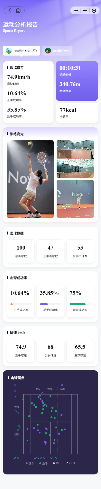

# 👋 您好，我是inshine

**资深 AI 算法工程师 | 工业机器人视觉专家**

---

## 🧑‍💻 关于我

7 年+ 跨 **工业机器人** 与 **计算机视觉** 复合落地经验。  
擅长从算法研发到系统集成的全栈能力，专注解决复杂场景下的感知与决策问题。

- 🏭 **工业落地**：主导 AI 视觉引导无序分拣机器人，实现 0.6m/s 高速传送带动态抓取。
- 📚 **教育 AI**：打造亿级调用智能批阅系统，累计创造超千万元商业价值。
- 🔬 **前沿探索**：快速复现顶会论文（MLLM-RoadCrack），独立完成边缘计算网球鹰眼系统。
- ⚙️ **技术栈**：Python · PyTorch · CODESYS · OpenCV · TensorRT · SNPE · vLLM

---

## 🚀 核心项目

### 📝 智能批阅系统 – 多模态 AI 集成与工程化
> *2024.10 – 至今 | 技术负责人*

集成 CV、NLP 与 LLM，实现非固定模板试卷的全自动批阅。  
创新点：YOLO 版面分析 + Qwen-VL 任意位置手写识别 + 三层分割模型解决超框作答。  
已覆盖数学、英语、物理三大学科，批阅准确率 >93%。

[🔗 项目详情](./projects/smart-marking.md) | 🎥 *（Demo 视频待补充）*

---

### 🏫 试卷抬头信息提取（上海考试院）
> *2026.04 – 2026.05 | 核心研发*

为上海中考成绩复核定制，双层版面分析 + 专用识别模型，准确提取姓名、报名号、座位号，已用于真实业务。

[🔗 项目详情](./projects/exam-header.md)

---

### ✍️ OCR 系列 – 手写文本与公式识别
> *2020.11 – 2024.09 | 核心研发*

构建教育 AI 核心引擎，总调用量 **超 5 亿次**，节约成本 **超千万元**。  
技术亮点：GAN 数据增强 + Transformer 公式识别（图像→LaTeX）+ 高可用服务部署。  
准确率：中文 >97%，公式 >94%。

[🔗 项目详情](./projects/ocr-series.md) | 📊 *（可视化样例待补充）*

---

### 🤖 智能无序分拣机器人
> *2019.03 – 2020.10 | 核心技术成员*

基于 OpenCV + CODESYS，实现 0.6m/s 高速传送带上的无序来料分拣。  
负责视觉感知、机器人控制与系统集成，成功落地并推广至多家分公司。

[🔗 项目详情](./projects/robotic-sorting.md) | 🎥 *（）*

---

### 🏭 设备预测性维护系统（智慧引擎）
> *2018.06 – 2019.02 | 核心开发*

构建分布式实时监控预警系统，异常响应从小时级缩短至分钟级。  
技术栈：C# / Python / Flask / Kafka / Redis / Cassandra。

[🔗 项目详情](./projects/predictive-maintenance.md)

---

## 🚀 兼职项目

### 🛣️ 道路裂缝分割 Agent
> *2026.07 – 2026.08 | 论文复现（兼职）*

基于 LangGraph 构建智能体，复现港科大 MLLM-RoadCrack 论文。  
实现 VLM 图像分类 + 像素级分割 + 拓扑化测量 + LLM 报告生成全自动化流程。

[🔗 项目详情](./projects/road-crack-agent.md) | 📊 *（）*

---

### 🎾 网球智能鹰眼分析系统
> *2026.01 – 2026.02 | 独立开发（兼职）*

基于边缘计算（Jetson）与轻量化模型，实现球员动作识别、网球轨迹追踪与落点统计。  
创新提出 TCN 事件检测、输入通道压缩，完成 TensorRT 量化部署。

[🔗 项目详情](./projects/tennis-eagle-eye-ai.md) | 🎥 *（）*

---

### 🔬 淡水微生物分析系统
> *2024.02 | 独立开发（兼职）*

基于 PaddleDetection + FastDeploy + C++，完成藻类检测模型的训练、加密 DLL 封装及离线推理。

[🔗 项目详情](./projects/microbe-analysis.md)

---

## 🛠️ 技能标签

| 类别 | 技术 |
| :--- | :--- |
| **编程语言** | Python（精通）、C++/C#（了解）、Java（熟练） |
| **AI 框架** | PyTorch、PaddlePaddle、LangGraph |
| **模型部署** | vLLM、ONNX、TensorRT、高通 SNPE、Jetson |
| **机器人** | CODESYS、ROS/ROS2（前期了解） |
| **CV / NLP** | YOLO、DB、CRNN、SVTR、Qwen 系列、LoRA 微调 |

---

## 📫 联系我

- 📧 邮箱：shinelover163@163.com  
- 💼 求职方向：机器人感知 / 具身智能 / 高级视觉算法工程师  
- 📍 当前坐标：上海 · 期待全国一线及新一线城市机会

---

## 📌 后续计划

- [ ] 为每个项目补充可视化架构图、效果截图或短视频演示  
- [ ] 撰写深度技术博客，分享核心问题解决思路  
- [ ] 完善英文版简历与项目说明  

---

> ✨ 本作品集持续更新中，欢迎关注我的技术成长之路。
